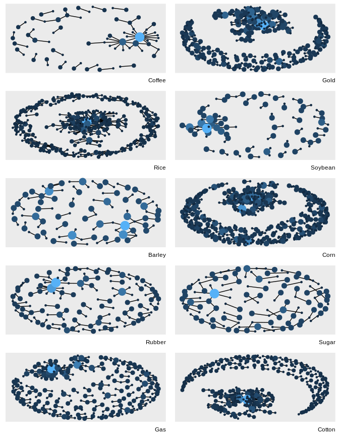

<!-- README.md is generated from README.Rmd. Please edit that file -->
<!-- badges: start -->
[](https://travis-ci.org/news-r/phrasenets) <!-- badges: end -->

phrasenets
==========

Phrasenets lets you build (very) simple but interpretable and insightful phrase networks, see the website for [more details](https://phrasenets.news-r.org/) on their nature.

Installation
------------

You can install the packages from Github with:

``` r
# install.packages("remotes")
remotes::install_github("news-r/phrasenets")
```

Example
-------

``` r
library(dplyr)
#> 
#> Attaching package: 'dplyr'
#> The following objects are masked from 'package:stats':
#> 
#>     filter, lag
#> The following objects are masked from 'package:base':
#> 
#>     intersect, setdiff, setequal, union
library(purrr)
library(ggraph)
#> Loading required package: ggplot2
library(tidygraph)
#> 
#> Attaching package: 'tidygraph'
#> The following object is masked from 'package:stats':
#> 
#>     filter
library(phrasenets)

data(reuters)

# create a graph for each commodity
subgraphs <- reuters %>% 
  group_split(category) %>% 
  map(phrase_net, text = text) %>% 
  map(filter_net, c("a", "the")) %>% 
  map(filter, occurences > 1) %>% 
  map(as_tbl_graph) %>% 
  map(function(x){
    mutate(x, size = centrality_degree())
  })

plot_it <- function(g, commodity){
  ggraph(g, layout = 'kk') + 
    geom_edge_fan(show.legend = FALSE) + 
    geom_node_point(aes(size = size, colour = size), show.legend = FALSE) + 
    labs(caption = tools::toTitleCase(commodity))
} 

commodities <- unique(reuters$category)

map2(subgraphs, commodities, plot_it) %>% 
  patchwork::wrap_plots(ncol = 2)
```


